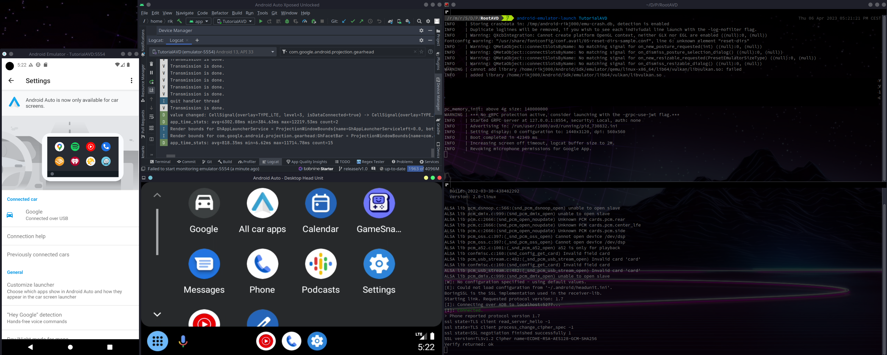

# Android Auto - Ultimate Dev Unit

<p align="left">
    <a href="https://www.iconomi.com/register?ref=zQQPK">
        
    </a> <a href="https://github.com/Rikj000/Android-Auto-Ultimate-Dev-Unit/blob/master/LICENSE">
        
    </a> <a href="https://www.buymeacoffee.com/Rikj000">
        
    </a>
</p>

This extensive guide will walk you though the steps of installing & configuring up a very handy emulator setup,
to develop & debug Android Auto apps / mods,
without needing to walk back and forth to your car for testing!

These steps where written on / for Linux users,
but the process should be nearly identical for Mac / Windows users.



## Table of contents
- [Android Auto - Ultimate Dev Unit](#android-auto---ultimate-dev-unit)
  - [Table of contents](#table-of-contents)
  - [Pre-requisites](#pre-requisites)
  - [1. Installation - Phone Emulator + Head Unit Emulator + SDK Platform-Tools](#1-installation---phone-emulator--head-unit-emulator--sdk-platform-tools)
  - [2. Installation - AVD (Android Virtual Device)](#2-installation---avd-android-virtual-device)
  - [3. Root AVD](#3-root-avd)
  - [4. Installation - King Installer](#4-installation---king-installer)
      - [Verify app installation](#verify-app-installation)
      - [Other options](#other-options)
  - [5. Installation - Android Auto](#5-installation---android-auto)
  - [6. Installation - Android Auto for phone screens](#6-installation---android-auto-for-phone-screens)
  - [7. Installation - Android Auto - Xposed Unlocked](#7-installation---android-auto---xposed-unlocked)
  - [8. Installation - Hail](#8-installation---hail)
  - [9. Usage](#9-usage)
    - [Phone \<=\> Desktop Head Unit](#phone--desktop-head-unit)
    - [AVD \<=\> Desktop Head Unit](#avd--desktop-head-unit)
    - [AVD without Android Studio](#avd-without-android-studio)
    - [More commands](#more-commands)

## Pre-requisites
- [Android Studio](https://developer.android.com/studio)
- [Git](https://git-scm.com/)

## 1. Installation - Phone Emulator + Head Unit Emulator + SDK Platform-Tools
**Desktop - Android Studio**
File => Settings => Appearance & Behavior => System Settings => Android SDK:
1. Android SDK Location => Edit => Configure Path => Next => Next => Finish
2. SDK Tools => Install:
    - Android Auto API Simulators
    - Android Auto Desktop Head Unit Emulator
    - Android Emulator
    - Android SDK Platform-Tools
3. Make the Emulators executable
    ```bash
    chmod u+x <android-sdk-path>/extras/google/auto/desktop-head-unit
    chmod u+x <android-sdk-path>/tools/emulator
    ```

## 2. Installation - AVD (Android Virtual Device)
**Desktop - Android Studio**
Tools => Device Manager 
1. Create device
    - Choose a device definition: Phone => Pixel 6 Pro *(Or your preference)* => Next
    - Select a system image: Recommended => Tiramisu / 33 / x86_64 / Android 13.0 (Google APIs) *(Or your preference)* => Download => Next
    - Verify Configuration: Show Advanced Settings
        - UnCheck `Enable Device Frame`
        - Alter to your preference *(E.g. AVD-Name, CPU cores, RAM)*
        - Finish
2. AVD-Name => Start => Wait for initial boot
3. AVD Window => Triple Dot Icon => Bug report => Uncheck `Sceenshot` + `Bug report data`

## 3. Root AVD 
**Desktop - Favorite terminal of choice:**
1. Make sure your AVD has booted properly / is running.
2. Git clone the `rootAVD` script:
    ```bash
    git clone https://github.com/newbit1/rootAVD.git
    ```
3. Make it executable
    ```bash
    chmod u+x ./rootAVD/rootAVD.sh
    ```
4. List all AVDs
    ```bash
    ./rootAVD/rootAVD.sh ListAllAVD
5. Root the desired AVD, e.g:
    ```bash
    ./rootAVD/rootAVD.sh <android-sdk-path>/system-images/android-33/google_apis/x86_64/ramdisk.img
    ```
6. Wait for the script to finish / for the device to reboot. If it doesn't reboot automatically after script completion, then try manually

**AVD:**
1. Settings
    - About Emulated Device => Tap build number a lot => Developer options unlocked
    - System => Developer options => Uncheck `Automatic system updates` *(To prevent losing root due to system updates)*
    - Apps => See all apps => Magisk => Install unknown sources => Allow from this source => Ok
2. Magisk Manager
    - Allow notifications
    - Requires Additional Setup => Ok => Wait for reboot
    - Settings => App
        => Hide the Magisk app => Grant super user access
        => Restore the Magisk app => Add shortcut to home screen
3. Magisk Manager (hidden as `Settings`) => Settings => Magisk => Check `Zygisk` => Reboot

## 4. Installation - King Installer
Android Auto requires that applications are installed through the Google Play Store to be usable.   
So we need to spoof the installer during installation, to "install as Google Play Store".

In this guide we'll install the applications we seek to use through **King Installer**   
*(With `Enable if you use rooted (LineageOS) phone` checked)*

**AVD:**
1. Download and install the latest **King Installer** [release](https://github.com/fcaronte/KingInstaller/releases) through your File Manager
2. Settings => Apps
    - Special app access => All files access => KingInstaller => Check `Allow access to manage all files`
    - See all apps => KingInstaller =>  Install unknown apps => Check `Allow from this source`

#### Verify app installation
To verify if the process of installing an app "as Google Play Store" went correctly, check as following:

**AVD:**
- Settings => Apps => See all apps => Name of installed App => Store *(at the bottom)*
- There you should see either of following, `App installed from ...` messages:
    - `license checker` - On AVDs without Google Play
    - `FakeStore` - On AVDs with MicroG *(Google Play Store stub)*
    - `Google Play Store` - On AVDs with Google Play Store enabled

#### Other options
- [Aurora Store](https://gitlab.com/AuroraOSS/AuroraStore) *(With `Root installer` as the installation method enabled!)*
- ADB
    ```bash
    adb push <path-to-apk>/android-auto.apk /data/local/tmp/android-auto.apk
    adb shell su -c pm install -i "com.android.vending" /data/local/tmp/android-auto.apk
    ```
- Package Manager *(Not recommended, because it doesn't spoof "as Google Play Store", but works for some apps)*

## 5. Installation - Android Auto
The default Android Auto stub in the system partition of AVDs prevents the installation of full Android Auto on AVDs.
To work around this, we'll replace the original AA stub with a patched one, provided by **aa4mg** *(Android Auto for MicroG)*.

**AVD:**
1. Download and install the latest **aa4mg** [release](https://github.com/sn-00-x/aa4mg/releases) *(Through Magisk Manager)* => Reboot
2. Settings => Apps => See all apps => Android Auto => Mobile data & Wi-Fi => UnCheck all
3. Download and install the latest **Android Auto** [x86_64 release from APKMirror](https://www.apkmirror.com/apk/google-inc/android-auto/variant-%7B%22arches_slug%22%3A%5B%22x86_64%22%5D%7D/) *([Through King Installer](#king-installer-installation))*
4. Settings => Connected Devices => Connection Preferences => Android Auto
    - System => UnCheck `Google Analytics`
    - About =>Tap version number a lot => Allow development settings => Ok
    - Triple dot icon => Developer settings
        - Application Mode => Developer
        - Check `Force debug logging`
        - Check `Unknown Sources`
        - Check `Enable debug overlay`
    - Close App
5. Settings => Connected Devices => Connection Preferences => Android Auto => General => Check `Taskbar widgets`
6. Settings => Notifications => Device & app notifications => Android Auto => Check `Allow notification access` => Ok *(**Settings will still be restricted!**)*
7. Settings => Apps => See all apps => Android Auto => Triple dot icon => Allow restricted settings
8.  Settings => Notifications => Device & app notifications => Android Auto => Check `Allow notification access` => Allow

## 6. Installation - Android Auto for phone screens
The Android Auto app likely won't open directly anymore,   
we'll use the **Android Auto for phone screens** shortcut launcher app to work around this.

**AVD:**
1. Download and install [Android Auto for phone screens](https://github.com/sn-00-x/aa4mg/raw/master/stubs/Android-Auto-for-phone-screens-v1.1.apk) from the aa4mg [`stubs`](https://github.com/sn-00-x/aa4mg/tree/master/stubs) folder *([Through King Installer](#king-installer-installation))*
2. Settings => Apps => See all apps => Android Auto for phonescreens => Mobile data & Wi-Fi => UnCheck all

## 7. Installation - Android Auto - Xposed Unlocked
Some apps have additional restrictions applied to them.   
To make these work correctly / reliably we'll need some additional Xposed hooks.

**AVD:**
1. Download and install [LSPosed (Zygisk) + Shamiko](https://lsposed.org/) *(Through Magisk Manager)* => Reboot
2.  Download and install [Android-Auto-Xposed-Unlocked](https://github.com/Rikj000/Android-Auto-Xposed-Unlocked/releases) *([Through King Installer](#king-installer-installation))*
3.  Notifications => LSPosed => Create shortcut => Add to homescreen
4.  LSPosed => Modules => Check `Enable module` + Check `Android Auto` => Reboot

## 8. Installation - Hail
Android Auto will launch the last used navigation app by default,   
which can be annoying if you seek to develop / test things out.

In this guide we'll freeze Google Maps through **Hail**.   
The benefit of this is that due to no navigation app being enabled,   
the Android Auto Head Unit will always open straight in it's app launcher.

**AVD:**
1. Download and install [Hail](https://github.com/aistra0528/Hail/blob/master/README_EN.md)
2. Hail 
    - Settings => Working mode => Check `Superuser - Disable` *(or `Shizuku - Disable` if you use Shizuku)* => Grant root permissions
    - Apps => Filter icon => Check `System` => Check `Maps`
    - Home => Triple dot icon => Freeze current

## 9. Usage

### Phone <=> Desktop Head Unit

**Phone:**
Plug USB into Desktop

**Desktop - Favorite terminal of choice:**
```bash
<android-sdk-path>/extras/google/auto/desktop-head-unit --usb
```

### AVD <=> Desktop Head Unit

**AVD:**
Android Auto => Triple dot icon => Start head unit server

**Desktop - Favorite terminal of choice:**
```bash
adb forward tcp:5277 tcp:5277
<android-sdk-path>/extras/google/auto/desktop-head-unit --bridge
```

### AVD without Android Studio
**Desktop - Favorite terminal of choice:**
```bash
# List all available AVDs
<android-sdk-path>/tools/emulator -list-avds
# Run <AVD-Name>
<android-sdk-path>/tools/emulator -avd <ADV-Name>
```

### More commands
```bash
# List all available commands
<android-sdk-path>/extras/google/auto/desktop-head-unit -help
<android-sdk-path>/tools/emulator -help
```

**Tip:** Add some aliases to your `.bashrc` or equivalent for the `emulator` and `desktop-head-unit` to make them easier to use!
